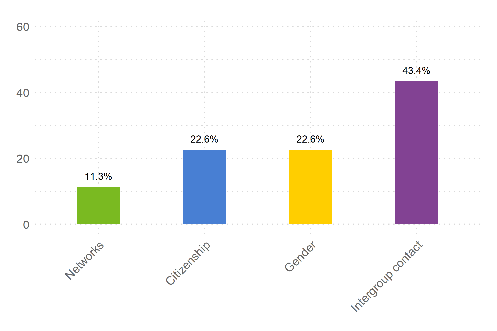
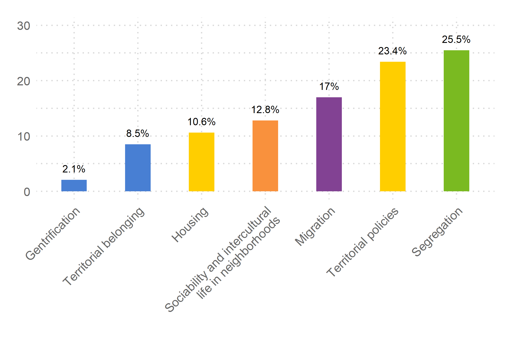

## About the diagram:

The diagram above shows the distribution of papers according to 6 thematic categories: Sociability, Conflict, Territorial factors, Socioeconomic factors, Political system and Others. We consider in the diagram all those papers reported during 2021 that have a Digital Object Identifier (DOI).

Important: These categories do not respond to the Centre's lines of research, but are another complementary way of organizing the Centre's productivity.

## Sociability

Considering Social cohesion as a state of affairs concerning both the vertical and the horizontal interactions among members of society as characterized by a set of attitudes and norms that includes trust, a sense of belonging and the willingness to participate and help, as well as their behavioral manifestations, this topic contributes to the analysis and understanding of social conflict and cohesion in Chile by integrating the interpersonal and intergroup dimensions into the macro-social context.

Download Sociability database

## Conflict

This topic examine the questions arising from these circumstances from four dimensions: disaffection and legitimacy of democracy; conflict with judicial and constitutional norms; conflicts and social movements; and the socio-cultural and political history of conflict in Chile.

Download Conflict database

## Territorial factors

Physical and geostatistical analysis brings an intersectoral and multi-scalar perspective to social cohesion research, revealing the significant coexistence of social, cultural and economic phenomena in space. 

Download Territorial factors database

## Socioeconomic factors

Considering reduction of disparities, inequalities and social exclusion as one of the two analytically distinct “social goal dimensions” defines by Berger-Schmitt (2000), this topic consider studies about, among other topics, real and perceived inequalities, and how different forms of inequality impact on the values and attitudes that motivate conflict and social cohesion, with a focus on education, work and the spatial dimension of inequalities. 

Download Socioeconomic factors database

## Political system

This refers to the maintenance of legitimacy of major political and social institutions – the state in particular – as mediators among individuals of different interests.

Download Political system database

